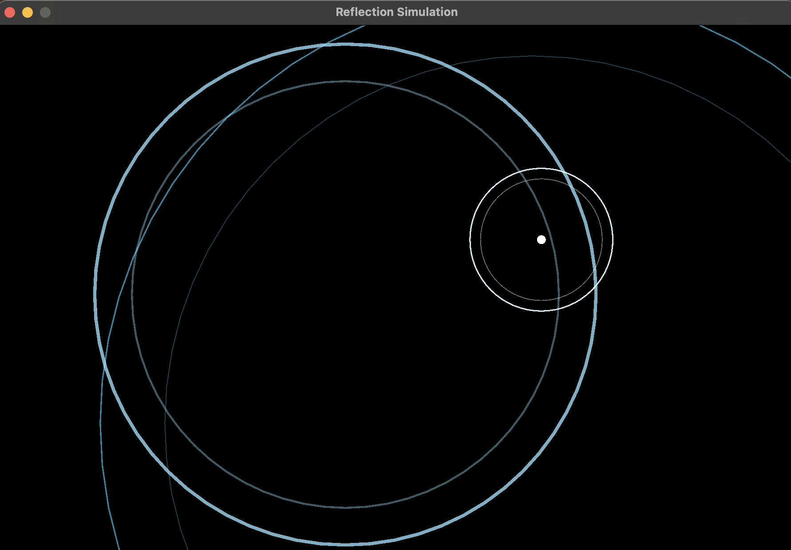

### Overview

### Install & run
```bash
brew install raylib
```
### Compile & run it
```bash
git clone https://github.com/fivawyr/tiny_relectionsimulation.git
cd in your folder
# Run it

g++ code.cpp -o reflect \y
    -std=c++17 \
    -I/opt/homebrew/include \
    -L/opt/homebrew/lib \
    -lraylib
./greflection
```

> Screenshot from the application 
### Resources 
- [Daniel Hirsch](https://www.youtube.com/@HirschDaniel/featured)
